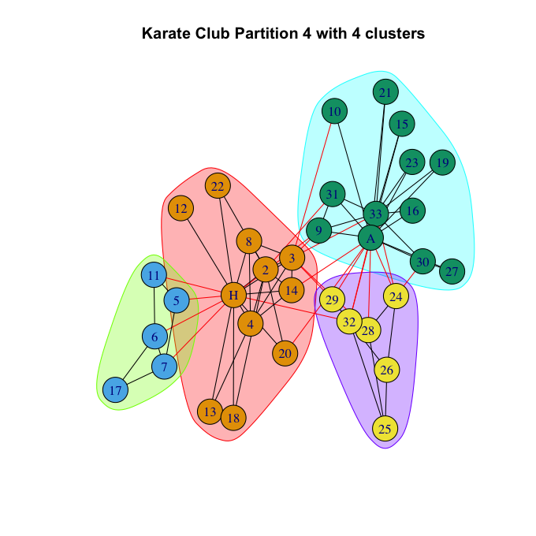
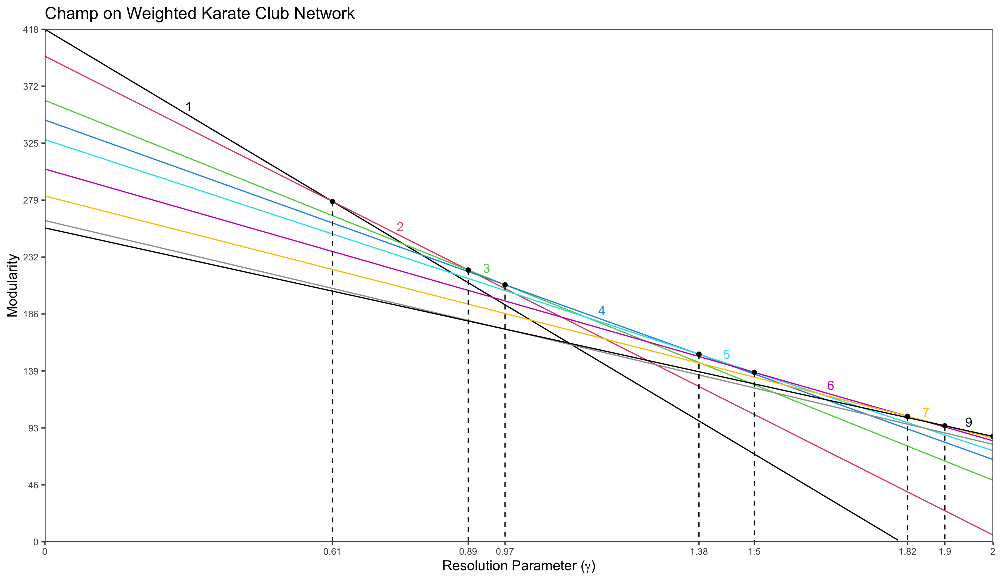
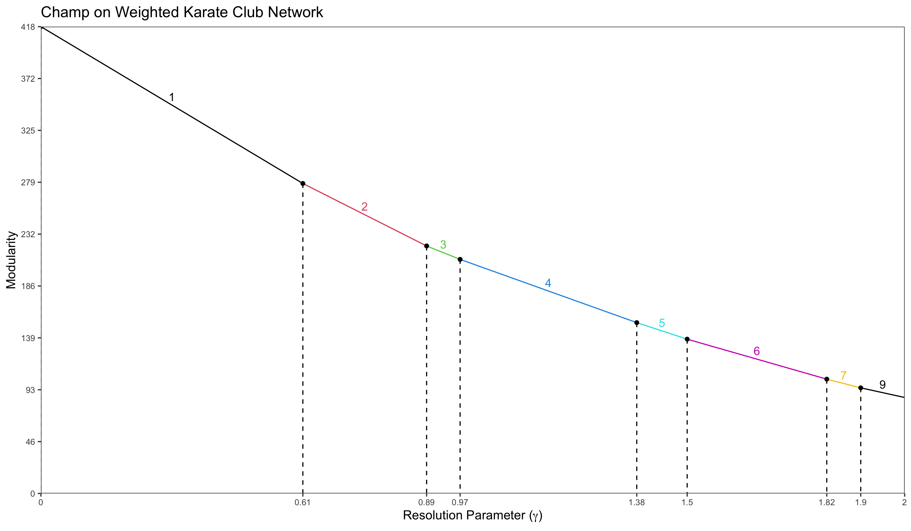

# An Implementation of the CHAMP Algorithm
Working with Dartmouth Applied Mathematics Professor Peter Mucha as a URAD Scholar, 
I implemented the CHAMP algorithm that was outlined in his paper 
[*Post-Processing Partitions to Identify Domains of Modularity Optimization*](https://www.mdpi.com/1999-4893/10/3/93).
The goal of the CHAMP Algorithm is to make community detection analysis for networks more straightforward.

### Example 1: Weighted Karate Club Network
Calling ```champ = run_champ(karate, weighted = TRUE, name = "Karate Club")```, you get the following summary


This highlights the performance of distinct partitions, where performance is measured by stability to variations in the values of gamma (```gamma_range```). Based on this metric, we find that in the Weighted Karate Club Network, the 2 and 4 cluster solutions perform the best.

The partition of the 2 cluster solution can be represented by the following two figures (```communities(champ$partitions[[1]])``` and ```figures\partition1```)


The partition of the 4 cluster solution can be represented by the following two figures (```communities(champ$partitions[[4]])``` and ```figures\partition1```)



In the ```figures``` folder, we also find three other figures. They display three different visualizations of the CHAMP algorithm (modularity lines for the top partitions).




