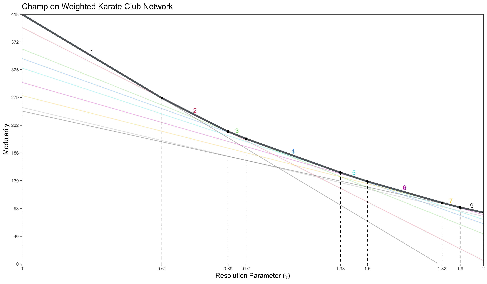

# An Implementation of the CHAMP Algorithm
(in progress)
Working with Dartmouth Applied Mathematics Professor Peter Mucha as a URAD Scholar, 
I implemented the CHAMP algorithm that was outlined in his paper 
[*Post-Processing Partitions to Identify Domains of Modularity Optimization*](https://www.mdpi.com/1999-4893/10/3/93).
The goal of the CHAMP Algorithm is to make community detection analysis for networks more straightforward.

### Example 1: Weighted Karate Club Network
Calling ```run_champ(karate, weighted = TRUE, name = "Karate Club")```, you get the following summary


This highlights the performance of distinct partitions, where performance is measured by stability to variations in the values of gamma (```gamma_range```). Based on this metric, we find that in the Weighted Karate Club Network, the 2 and 3 cluster solutions perform the best.
The partitions of the 2 cluster solution are as follows ()
insert image
The partitions of the 3 cluster solution are as follows ()
image

In the ```figures``` folder, we get five different figures. The first three figures display three different visualizations of the CHAMP algorithm (modularity lines for the top partitions). The other two figures are the top two partitions determined by the stability metric.

<p float="left">
  
   
  
</p>

add figures here!
